
 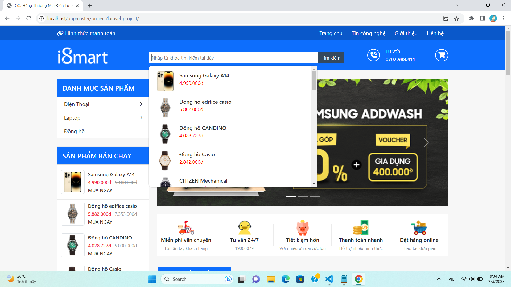 

## Website Thương Mại Điện Tử ISMART
- Website này được xây dựng với mục đích cung cấp cho người dùng một nền tảng mua và bán hàng trực tuyến.
- Website được xây dựng gồm 2 phần: Client(phía người dùng) và Admin(phía quản trị viên).
<h4>Mô tả các chức năng chính:</h4>

<strong>Phía Client</strong>

- Trình duyệt sản phẩm: Client sẽ hiển thị danh sách sách sản phẩm cho người dùng xem. Người dùng có thể tìm kiếm, sắp xếp, lọc sản phẩm theo yêu cầu. Đồng thời người dùng có thể xem thông tin chi tiết từng sản phẩm.

- Giỏ hàng: Client sẽ cung cấp chức năng giỏ hàng. Cho phép người dùng có thể thêm sản phẩm vào giỏ hàng, chỉnh sửa số lượng, xóa sản phẩm ra khỏi giỏ hàng và tính tổng số tiền trong giỏ hàng.

- Thanh toán: Client cung cấp chức năng thanh toán cho người dùng. Người dùng có thể chọn phương thức thanh toán, nhập thông tin thanh toán và xác nhận đơn hàng.

- Trang tin tức: Client hiển thị các bài viết để người dùng đọc và tương tác với nội dung.

<strong>- Hình ảnh mô tả:<strong>
 

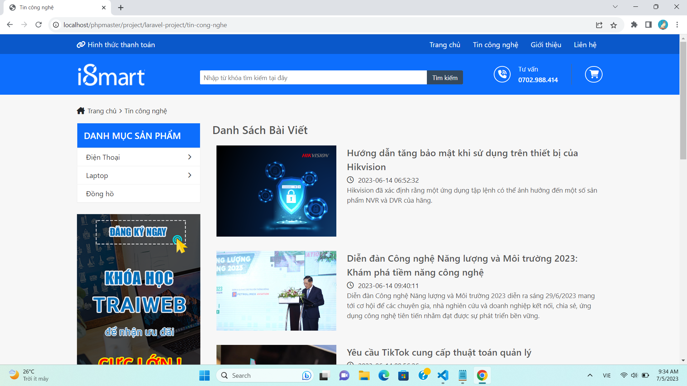
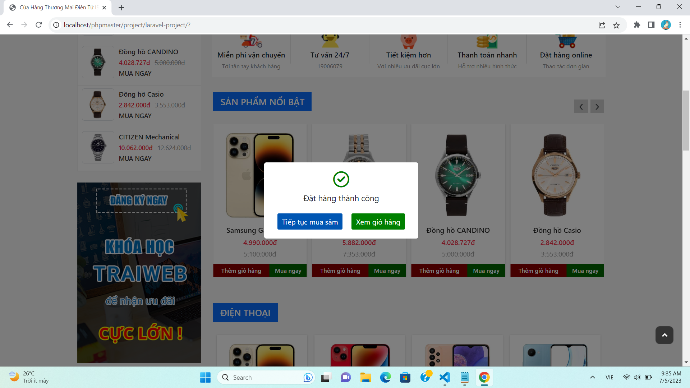
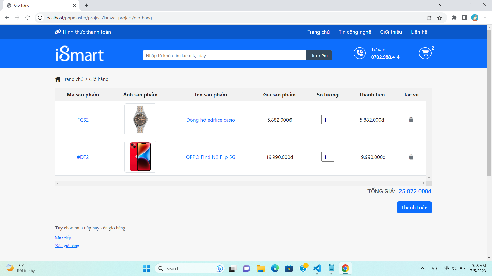
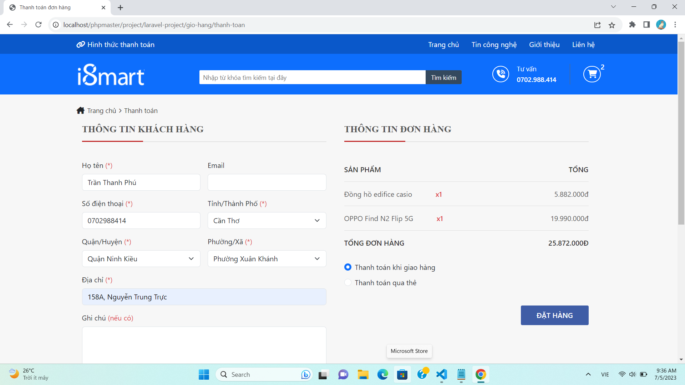
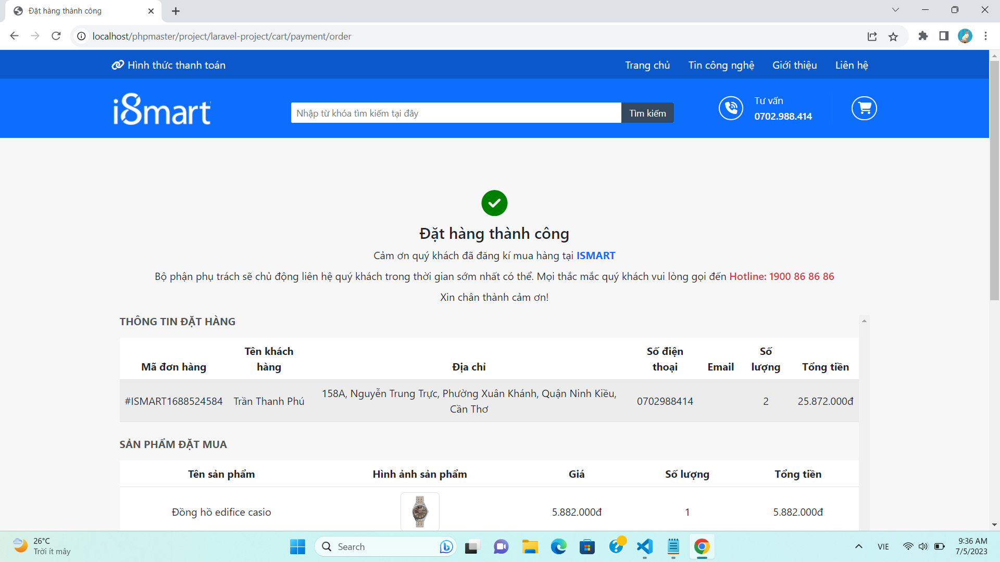

<strong>Phía ADMIN</strong>

- Quản lý sản phẩm: ADMIN có quyền thêm, sửa, xóa, cập nhật thông tin về sản phẩm. ADMIN có thể thêm sản phẩm mới, cập nhật giá, danh mục, hình ảnh sản phẩm, xóa sản phẩm ra khỏi hệ thống,...

- Quản lý đơn hàng: ADMIN có quyền xem thông tin các đơn hàng từ người dùng, có thể cập nhật thông tin vận chuyển của đơn hàng và quản lý thanh toán. 

- Quản lý danh mục: ADMIN có quyền tạo, chỉnh sửa, xóa các danh mục sản phẩm. ADMIN có thể quản lý các danh mục con, phân loại sản phẩm vào các danh mục con khác nhau để thuận tiện cho việc tìm kiếm, lọc sản phẩm.

- Thống kê và báo cáo: ADMIN có thể xem các báo cáo về doanh thu, số lượng đơn hàng đang xử lí, đơn hàng chờ duyệt, đơn hàng thành công. Giúp dễ dàng quản lí việc kinh doanh cho Website.

- Bảo mật và quản lí hệ thống: ADMIN có quyền quản lí bảo mật và phân quyền truy cập vào hệ thống thông qua chức năng Login. Quản lí các quản trị viên trên hệ thống.

<strong>- Hình ảnh mô tả:<strong>
 

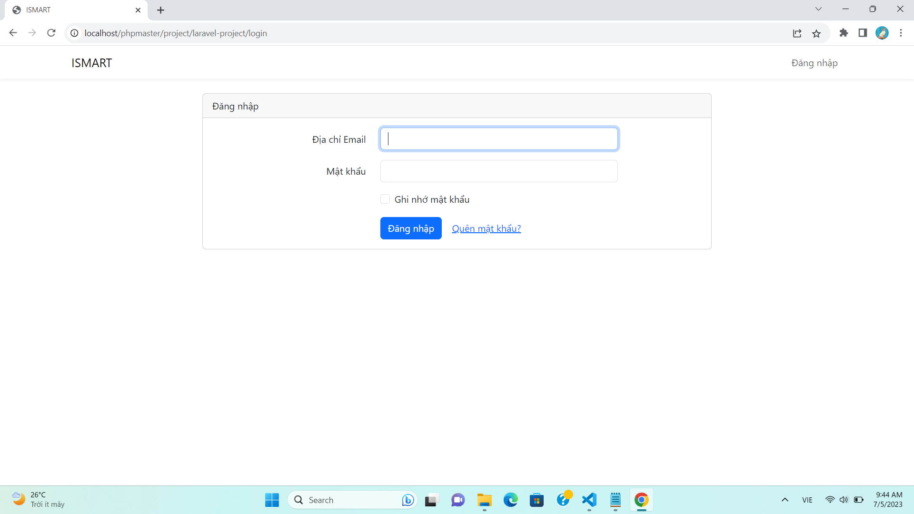
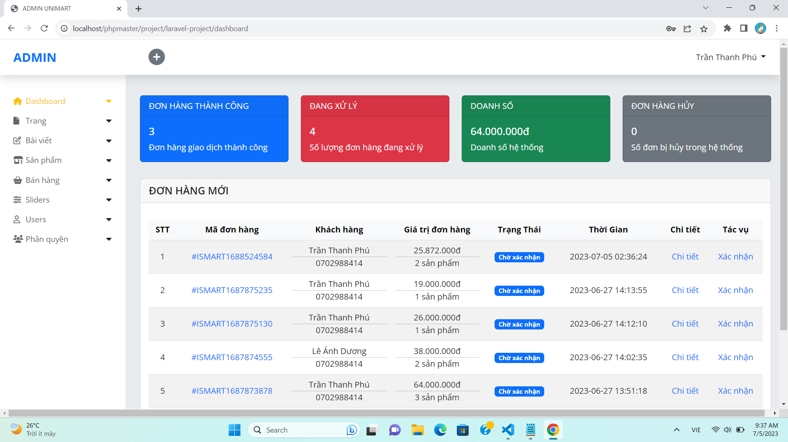
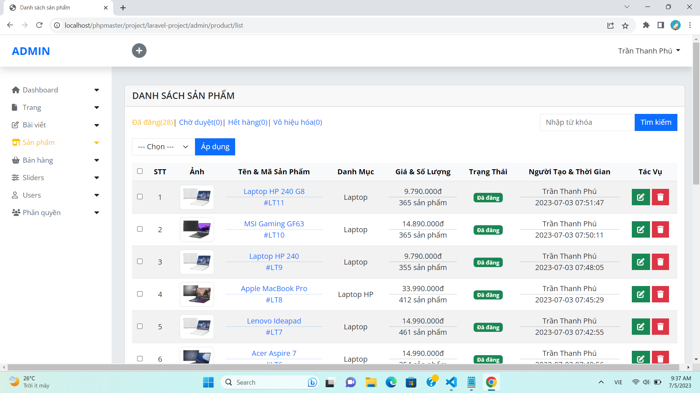
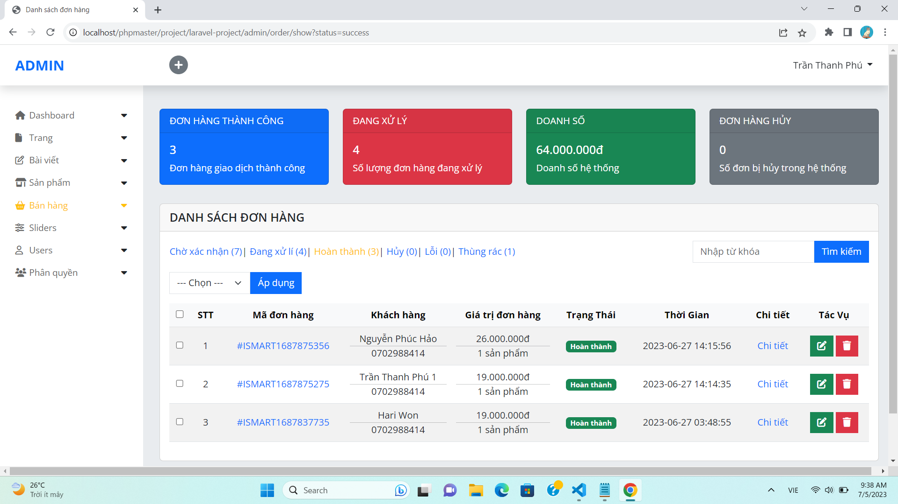
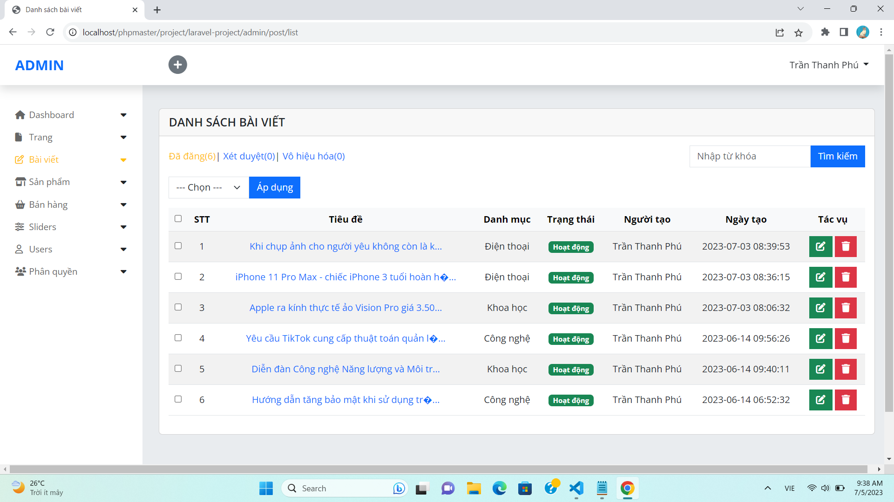

Qua toàn bộ phần trình bày phía trên về trang website rất mong được sự đóng góp ý kiến của mọi người. 
Mình đã có đính kèm file chứa Database của dự án mọi người có thể clone code về xem qua thử. Xin cảm ơn!

